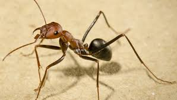

Cour-git
=========
## Attention aux fourmis!
https://fr.wikipedia.org/wiki/Fourmi

-----------
### Les dangers inherent aux ballades en foret.
1. Les monticules bizares
2. Des petits trucs qui bougent sur le sol.
* Elles piquent.
* Elles mordent.
* Elles crachent.

 | Zones | Présence |
 |-------|:--------:|
 |Foret  |  oui     |
 |Desert |  oui     |
 |Maison |  oui     |

------------
